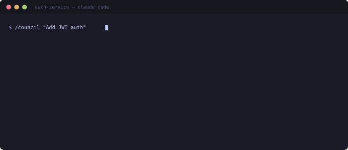

# Guild

[](https://www.npmjs.com/package/guild-agents)
[](https://www.npmjs.com/package/guild-agents)
[](https://github.com/guild-agents/guild/actions/workflows/ci.yml)
[](LICENSE)

**Guild makes Claude Code think before it builds.**

<p align="center">
  
</p>

Without Guild, Claude Code writes code immediately. No evaluation, no design, no review. With Guild, every feature goes through structured phases — evaluated by an advisor, designed by a tech lead, reviewed, and validated — before anything ships.

```bash
npx guild-agents init
```

## The Problem

Claude Code is powerful but unstructured. Ask it to "add authentication" and it starts writing code immediately. No one evaluated whether the approach makes sense. No design doc captures the trade-offs. No review gate catches issues before they compound. Next session, all that context is gone.

## How Guild Solves It

Guild installs **spec-first workflows** and **specialized role definitions** as `.claude/` markdown files in your project. Claude Code reads them natively as slash commands. The process enforces quality gates — you can't skip evaluation, you can't ship without review.

- **`/guild:build-feature`** — 5-phase pipeline: evaluate, design, implement, review, QA. Code comes after the design doc.
- **`/guild:council`** — 3 agents analyze your idea in parallel with different perspectives, then synthesize into a decision with a spec document.
- **`/guild:tdd`** — No production code without a failing test first. Enforces red-green-refactor.
- **`/guild:debug`** — No fixes without root cause investigation. Systematic 4-phase process.
- **`/guild:session-start`** / **`/guild:session-end`** — SESSION.md captures where you stopped. Claude Code memory captures what you learned. You resume with full context.

## Quality You Can Measure

Most agent frameworks can't tell you if their skills actually fire when they should. Guild ships a benchmark suite.

```bash
guild eval                # Structural assertions: steps exist, roles correct, gates present
guild eval --triggers     # Trigger accuracy: do user prompts route to the right skill?
guild eval --semantic     # LLM-based scoring via Haiku for higher-fidelity testing
guild eval --suggest      # Keyword gap analysis with improvement suggestions
```

Every trigger run records results to a rolling benchmark with per-skill accuracy, precision, recall, and delta vs previous run. Regressions are caught before they ship.

## The Pipeline

```text
/guild:build-feature "Add JWT auth"
         |
         v
    +-----------+     +-----------+     +-----------+
    | Evaluate  |---->|  Design   |---->|   Build   |
    |  advisor  |     | tech-lead |     | developer |
    +-----------+     +-----------+     +-----+-----+
                                              |
                                        +-----+-----+
                                        v           v
                                  +-----------++-----------+
                                  |  Review   ||    QA     |
                                  +-----------++-----------+
```

Five phases. Phases 1-2 happen before any code is written. Gates between phases can't be skipped.

## Install

**As a Claude Code plugin** (recommended):

```
/plugin marketplace add Guild-Agents/guild
/plugin install guild
```

All 10 skills and 6 roles are available immediately as `/guild:*` commands.

**As an npm package** (for the eval CLI):

```bash
npm install -g guild-agents
guild init
```

## Skills

| Skill | What it does |
| --- | --- |
| `/guild:build-feature` | Full 5-phase pipeline with quality gates |
| `/guild:council` | Multi-perspective deliberation — 3 roles debate, then synthesize |
| `/guild:create-pr` | Structured pull request from current branch |
| `/guild:qa-cycle` | QA and bugfix loop until clean |
| `/guild:tdd` | TDD red-green-refactor — no code without a failing test |
| `/guild:debug` | Systematic 4-phase debugging — no fixes without root cause |
| `/guild:guild-specialize` | Explore your codebase, enrich CLAUDE.md with real conventions |
| `/guild:re-specialize` | Incremental update when your stack changes |
| `/guild:session-start` | Resume from SESSION.md + Claude Code memory |
| `/guild:session-end` | Save state + durable learnings to memory |

## Roles

6 role definitions that give Claude Code distinct perspectives:

| Role | Perspective |
| --- | --- |
| advisor | Strategic direction. First gate — evaluates ideas before work begins |
| tech-lead | Technical approach. Breaks features into tasks with acceptance criteria |
| developer | Implementation. Follows conventions, writes tests, makes atomic commits |
| code-reviewer | Quality. Reviews patterns, security, and technical debt |
| qa | Validation. Tests edge cases, regressions, acceptance criteria |
| bugfix | Diagnosis. Isolates root causes, applies targeted fixes |

Each role is a `.md` file with identity, responsibilities, and boundaries. Claude Code reads them via its native Agent tool.

## Session Continuity

Claude Code's memory system stores long-term knowledge (who you are, lessons learned). But it explicitly excludes ephemeral work state — what you were building, which branch, what phase. That's the gap Guild fills.

`/guild:session-end` writes to **both layers**:
- **SESSION.md** — where you stopped: task, branch, phase, next steps (overwritten each session)
- **Claude Code memory** — what you learned: decisions, lessons, references (persists across sessions)

`/guild:session-start` reads from **both** and presents a unified summary.

## When NOT to Use Guild

Guild is overkill for: throwaway scripts, exploratory prototypes, single-file utilities, or anything where you'd rather ship fast than ship right. The 5-phase pipeline has cost — use it when that cost buys you something.

## How Is This Different?

Guild isn't an editor (Cursor), isn't a pair-programmer (Aider), isn't an autonomous agent (Devin). It's a **methodology layer** on top of Claude Code. If you already use Claude Code and want structured spec-first workflows with quality gates, Guild adds the discipline. If you don't use Claude Code, Guild isn't for you.

## How It Works

Guild installs role definitions and skill workflows as markdown files in `.claude/`. Claude Code discovers and executes them natively — no custom runtime, no extra process, no API calls. When you type `/guild:build-feature`, Claude Code reads the skill, follows the phases, and spawns agents using its own Agent tool.

Guild defines **what** happens. Claude Code decides **how** to execute it.

## CLI

```bash
guild init              # Interactive project onboarding
guild new-agent <name>  # Create a custom role
guild status            # Show project status
guild doctor            # Diagnose setup
guild list              # List roles and skills
guild eval              # Run structural skill evaluations
guild workspace init    # Create a multi-repo workspace
```

## Guild Builds Itself

Every feature in Guild goes through the same spec-first pipeline that Guild installs in your project.

## Contributing

See [CONTRIBUTING.md](.github/CONTRIBUTING.md).

## License

MIT -- see [LICENSE](LICENSE).
